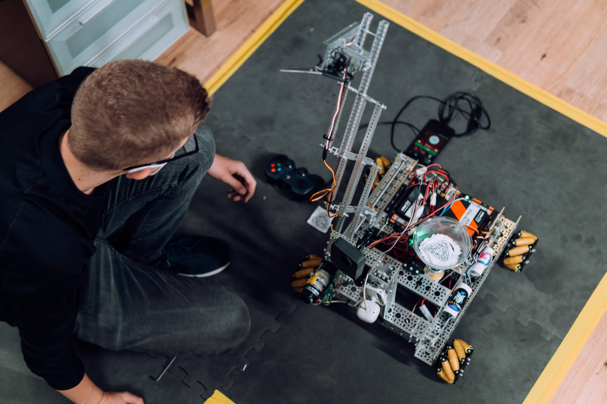
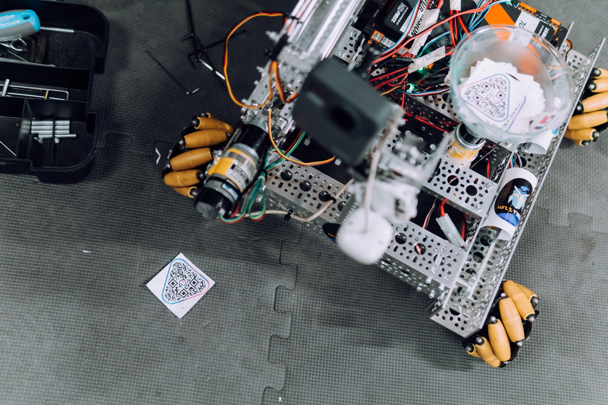

# WizzTech x GuidefAI - QRBot

In collaboration with GuidefAI, we have developed an autonomous robot that can take instructions from scanning QR code.

## Programming

The code was written in Java.

We are scanning the QR code using a webcam. The QR codes give us some values, and with a switch, the robot does different things. 

Members of the programming field :
- Teo Maxim (see Teo's [GitHub profile](https://github.com/tmaxmax))
- Vlad Tomici (see Vlad's [GitHub profile](https://github.com/VladTomici14))
- Mihai Albu (see the Mihai's [GitHub profile](https://github.com/LittleGreenMen-1))

## About GuidefAI

GuidefAI is a startup that wants to replace all the user manuals in a digital variant, by scanning a QR code. 

Check them out here :  
👉 [Facebook](https://www.facebook.com/guidefai.com)  
👉 [Instagram](https://www.instagram.com/guidefai/)  
👉 [LinkedIn](https://www.linkedin.com/company/gdfi/)  
👉 [Website](https://guidefai.com/)

## Thanks

Special thanks to GuidefAI for collaborating with us and much love to Darius Dorobantu for making this video.

Check Doro out here: [@dorobantudarius](https://www.instagram.com/dorobantudarius/)

Also check out this video: [GuideifAI x WizzTech](https://www.youtube.com/watch?v=mADIxcPGnT4) 

 Created with love and passion 💜 

 Timisoara, Romania 

 nov 2021 
